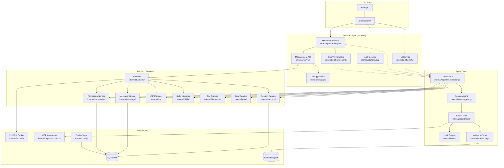
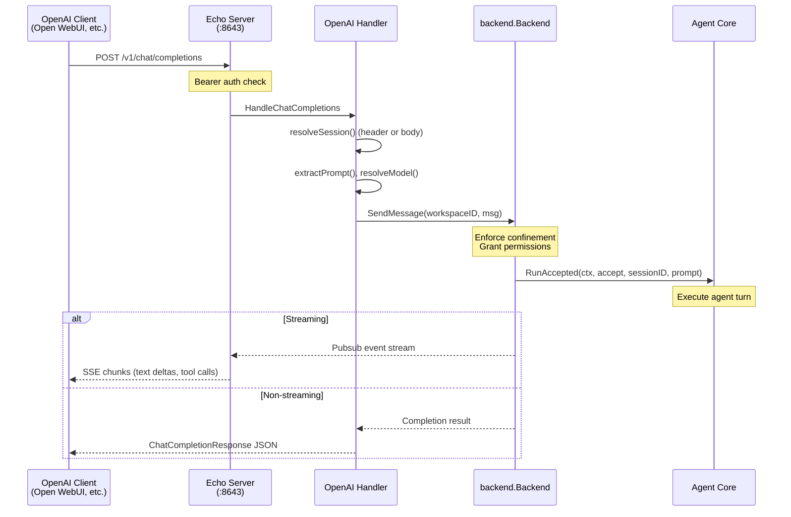
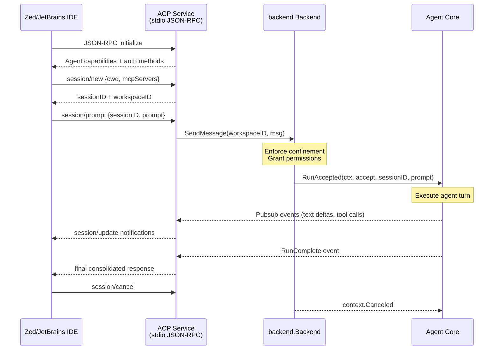

# Phosphor Architecture Overview

## Philosophy

Phosphor is a **modular agent platform** where the transport layer (TUI, HTTP API, ACP) is decoupled from the agent core via a `Service` interface and `Registry`. The `backend.Backend` provides transport-agnostic business logic for workspaces, sessions, agents, permissions, config, LSP, MCP, and file tracking. Services plug in via `phosphor.json` configuration.

---

## Directory Layout



---

## Service Interface Design

### Base Service

Every service in `internal/platform/` implements the `Service` interface (`internal/platform/service.go:9`):

```go
type Service interface {
    Name() string
    Start(ctx context.Context) error
    Stop(ctx context.Context) error
    Describe() string
}
```

### Agent-Connected Service

Transports that interact with the agent core implement `AgentService` (`internal/platform/service.go:28`):

```go
type AgentService interface {
    Service
    Connect(ctx context.Context) error
    SetPromptHandler(handler PromptHandler)
    SendPrompt(ctx context.Context, req PromptRequest) error
}
```

Supporting types: `PromptEvent`, `PromptRequest`, `EventType`, `PromptMode`, `Recipient`, `Image`.

### Registry

The `Registry` (`internal/platform/registry.go:9`) manages all registered services:

```go
type Registry struct {
    services      []Service
    agentServices []AgentService
    started       map[string]bool
    logger        *slog.Logger
    gov           *Governance
}

func (r *Registry) StartAll(ctx context.Context) error
func (r *Registry) StopAll(ctx context.Context) error
```

Starts services in registration order, skips blocked ones via governance. Stops in reverse order.

### Governance

The `Governance` layer (`internal/platform/governance.go:11`) checks three things before starting each service:

1. **Service enabled** — Is it `enabled: true` in `phosphor.json`?
2. **Egress allowed** — Is egress to that platform permitted in `security.allowed_egress`?
3. **Auth configured** — Is auth key present when required?

If any check fails, the service is skipped (no fail-fast).

---

## Implemented Services

### 1. TUI Service (`internal/platform/tui/service.go`)

Wraps the existing Bubble Tea terminal interface as a registered service.

- **Name:** `"tui"`
- **Transport:** Local terminal (stdin/stdout)
- **Does NOT implement AgentService** — it directly calls backend and receives events via `app.Events()`
- **Lifecycle:** `Start()` creates a Bubble Tea program, subscribes to workspace events, runs asynchronously. `Stop()` sends `Quit()`.
- **Exposed via:** `phosphor run` (when terminal is present)

### 2. HTTP API Service (`internal/platform/httpapi/service.go`)

Wraps two servers into one service:

- **Name:** `"http-api"`
- **Management API:** The existing `server.Server` (HTTP/JSON REST, ~60 endpoints at `internal/server/`) covering workspaces, sessions, agent control, LSP ops, MCP, permissions, skills, config management. SSE event streaming at `/v1/workspaces/{id}/events`. Swagger docs at `/v1/docs/`.
- **OpenAI API:** An Echo-based server on a separate port (default 8643) with OpenAI-compatible endpoints.
- **Lifecycle:** `Start()` launches both servers as goroutines. `Stop()` shuts down both.

### 3. ACP Service (`internal/platform/acp/service.go`)

Implements the Agent Client Protocol v1 over stdio JSON-RPC.

- **Name:** `"acp"`
- **Transport:** stdio (newline-delimited JSON)
- **ACP Methods Implemented:**
  - `initialize` — returns agent info, capabilities, auth methods
  - `session/new` — creates a new conversation session
  - `session/load` — loads an existing session
  - `session/prompt` — sends a prompt to the agent with streaming updates
  - `session/cancel` — cancels a running prompt
  - `session/close` — closes a session
  - `session/delete` — deletes a session
  - `session/resume` — resumes a session
  - `session/set_mode` — sets session mode (e.g., "default")
  - `logout` — handles logout
- **Streaming:** Sends `session/update` notifications via stdout for text deltas, tool calls, thinking content, and final responses
- **Exposed via:** `phosphor acp` command (used by Zed, JetBrains IDEs)

### 4. OpenAI API (`internal/platform/openai/`)

HTTP handlers mounted on the Echo server within the HTTP API Service:

- `**/health**` — health check
- `**/v1/chat/completions**` — OpenAI chat completions (streaming and non-streaming)
- `**/v1/responses**` — OpenAI Responses API
- `**/v1/models**` — models listing
- **Auth:** Bearer token middleware (`internal/platform/openai/auth.go`) — keyed by `API_SERVER_KEY` env var or config
- **Streaming:** SSE with OpenAI-compatible chunk format via pubsub event subscription (`internal/platform/openai/stream.go`)
- **Session resolution:** Supports `X-Phosphor-Session-Id` header and `session_id` in request body for persistent conversations

---

## Configuration Schema

The `Config` struct (`internal/config/config.go:915`) includes two new top-level sections:

```go
type Config struct {
    // ... existing fields (Models, Providers, MCP, LSP, etc.)
    
    Services map[string]ServiceEntry `json:"services,omitempty"`
    Security *SecurityConfig         `json:"security,omitempty"`
}

type ServiceEntry struct {
    Enabled bool       `json:"enabled"`
    Port    int        `json:"port,omitempty"`
    Host    string     `json:"host,omitempty"`
    Auth    AuthConfig `json:"auth,omitempty"`
}

type AuthConfig struct {
    Type string `json:"type"`  // "none" | "bearer"
    Key  string `json:"key,omitempty"`
}

type SecurityConfig struct {
    AllowedEgress AllowedEgressConfig `json:"allowed_egress,omitempty"`
    ToolBlacklist []string            `json:"tool_blacklist,omitempty"`
    ReadOnly      bool                `json:"read_only,omitempty"`
}

type AllowedEgressConfig struct {
    HTTP     bool `json:"http,omitempty"`
    Discord  bool `json:"discord,omitempty"`
    Slack    bool `json:"slack,omitempty"`
    Telegram bool `json:"telegram,omitempty"`
}
```

### Example `phosphor.json`

```jsonc
{
  "services": {
    "tui": {
      "enabled": true
    },
    "http-api": {
      "enabled": true,
      "port": 0,
      "host": "127.0.0.1",
      "auth": { "type": "bearer", "key": "${API_SERVER_KEY}" }
    },
    "openai-api": {
      "enabled": true,
      "port": 8643,
      "host": "127.0.0.1",
      "auth": { "type": "bearer", "key": "${API_SERVER_KEY}" }
    },
    "acp": {
      "enabled": false
    }
  },
  
  "security": {
    "allowed_egress": {
      "http": true,
      "discord": false,
      "slack": false,
      "telegram": false
    },
    "tool_blacklist": [],
    "read_only": false
  }
}
```

---

## CLI Commands

### `phosphor` (default — TUI + HTTP)

`internal/cmd/root.go:105` — When run without a subcommand:

1. Creates a workspace with the agent core initialized
2. If terminal present: registers and starts **TUI Service**
3. If not in client/server mode: registers and starts **HTTP API Service** (if enabled)
4. Calls `registry.StartAll()`
5. Waits for TUI exit or interrupt signal
6. Calls `registry.StopAll()` on shutdown

### `phosphor server`

`internal/cmd/server.go` — Starts only the HTTP API Service:

1. Loads config from global workspace dir
2. Creates **HTTP API Service** (management + OpenAI API)
3. Registers with Registry, calls `StartAll()`
4. Blocks on interrupt signal
5. Calls `StopAll()` on shutdown

### `phosphor acp`

`internal/cmd/acp.go` — Starts only the ACP Service:

1. Loads config, stops any running server (to avoid DB lock conflicts)
2. Creates a fresh `backend.Backend`
3. Creates **ACP Service**, registers with Registry
4. Calls `StartAll()` — blocks on stdio JSON-RPC loop
5. Calls `StopAll()` on shutdown

---

## Prompt Flow: HTTP API (OpenAI)



---

## Prompt Flow: ACP (IDE Integration)



---

## Management API vs OpenAI API

The HTTP API Service runs two servers on different ports:


| Aspect        | Management API                                                                      | OpenAI API                                                       |
| ------------- | ----------------------------------------------------------------------------------- | ---------------------------------------------------------------- |
| **Port**      | Default Unix socket / named pipe (configurable via `--host`)                        | TCP :8643 (configurable)                                         |
| **Framework** | Standard library `net/http`                                                         | Echo v5                                                          |
| **Endpoints** | ~60 REST endpoints for workspace/session/agent/LSP/MCP/permission/config management | `/health`, `/v1/chat/completions`, `/v1/responses`, `/v1/models` |
| **Auth**      | None (local socket/pipe)                                                            | Bearer token (`API_SERVER_KEY`)                                  |
| **SSE**       | `/v1/workspaces/{id}/events` with `client_id` for multi-client                      | Chat completions streaming via SSE                               |
| **Swagger**   | Yes (`/v1/docs/`)                                                                   | No                                                               |
| **Purpose**   | Programmatic control of Phosphor                                                    | Interop with OpenAI ecosystem tools                              |


---

## What's Shared Across Services

All services that dispatch prompts to the agent core share:

- `**backend.Backend**` — transport-agnostic workspace/session/agent management with path confinement enforcement
- **Pub/Sub Broker** (`internal/pubsub`) — cross-component messaging for real-time event delivery
- **Security** — `backend.SendMessage()` enforces workspace confinement; permission checks apply uniformly
- **Session persistence** — SQLite-backed via `internal/db/` (sqlc-generated)

---

## Service Enablement Flow

```mermaid
flowchart TD
    A[phosphor.json] --> B[Governance.Check]
    
    B --> C{Service enabled?}
    C -->|No| D[Skip service]
    C -->|Yes| E{Egress allowed?}
    
    E -->|No<br/>(http-api, discord, etc.)| D
    E -->|Yes or stdio<br/>(acp)| F{Auth configured?}
    
    F -->|Bearer required but no key| D
    F -->|OK| G[Registry.Start]
    
    G --> H[Service running]
    
    style D fill:#ffcdd2
    style H fill:#c8e6c9
```

---

## Existing Server Endpoints (Management API)

The management API at `internal/server/` provides these endpoint groups:


| Group             | Endpoints                                                                             | Purpose                                            |
| ----------------- | ------------------------------------------------------------------------------------- | -------------------------------------------------- |
| **System**        | `/v1/health`, `/v1/version`, `/v1/control`                                            | Health, version info, shutdown                     |
| **Workspaces**    | `/v1/workspaces`, `/v1/workspaces/{id}`, `/v1/workspaces/{id}/events`                 | CRUD + SSE streaming                               |
| **Sessions**      | `/v1/workspaces/{id}/sessions`, `/{sid}`, `/{sid}/messages`, `/{sid}/history`         | Session CRUD, messages, history                    |
| **Agent Control** | `/v1/workspaces/{id}/agent`, `/{sid}/cancel`, `/{sid}/summarize`, prompt list/clear   | Agent lifecycle, cancel, summarize, queued prompts |
| **LSP**           | `/v1/workspaces/{id}/lsps`, `/{lsp}/diagnostics`, start/stop                          | LSP management and diagnostics                     |
| **MCP**           | `/v1/workspaces/{id}/mcp` (in proto)                                                  | MCP server management                              |
| **Permissions**   | `/v1/workspaces/{id}/permissions/grant`, `/{sid}/skip`                                | Grant/deny/skip tool permissions                   |
| **Config**        | `/v1/workspaces/{id}/config/set`, `/{id}/config/model`, refresh-oauth, import-copilot | Runtime config mutations                           |
| **File Tracker**  | `/v1/workspaces/{id}/filetracker/*`                                                   | Track and read files touched by agent              |


---

## Testing

Each service has unit tests in its package:

- `internal/platform/registry_test.go` — Registry StartAll/StopAll/Register
- `internal/platform/governance_test.go` — Governance Check (enabled, egress, auth)
- `internal/platform/tui/service_test.go` — TUI Service lifecycle
- `internal/platform/httpapi/service_test.go` — HTTP API Service lifecycle
- `internal/platform/acp/service_test.go` — ACP JSON-RPC request handling
- `internal/platform/openai/handler_test.go` — OpenAI handler (chat completions, responses)
- `internal/platform/openai/stream_test.go` — SSE streaming

