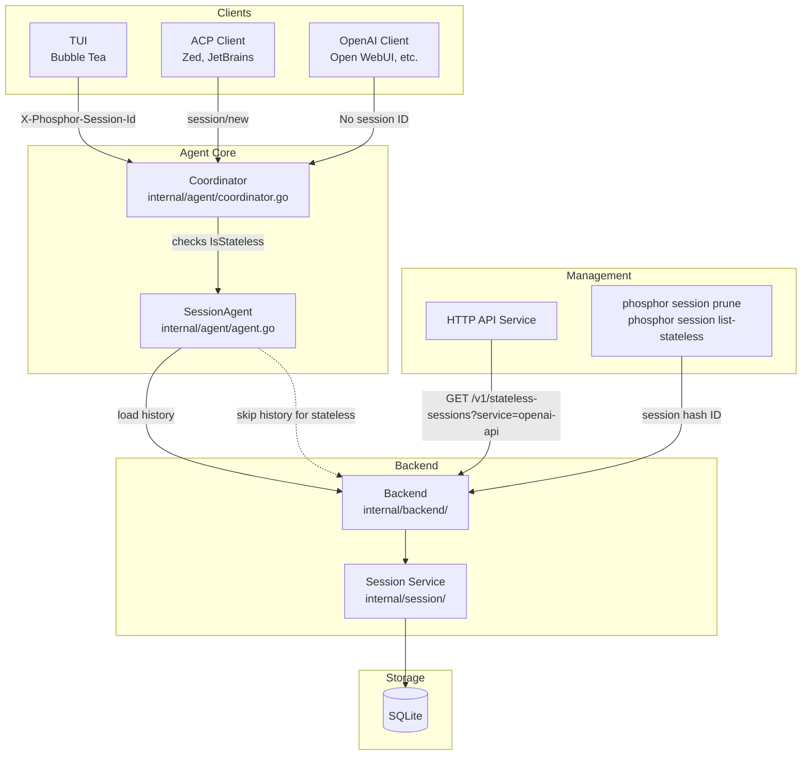

# Session Architecture

## Overview

Phosphor uses a two-tier session model to support both interactive agent conversations (via the TUI, ACP, or any client that sends `X-Phosphor-Session-Id`) and stateless API usage from OpenAI-compatible clients. Both tiers persist messages in SQLite, but they differ in how the agent loads history, how they appear in the TUI, and whether they can be resumed by a client.

---

## Regular (Stateful) Sessions

These are the primary sessions used by the TUI, ACP, and any client that explicitly identifies itself with a session ID.

### Lifecycle

1. **Creation** — A new session is created via `session.Service.Create()`, which generates a UUID and inserts a row into SQLite.
2. **Message persistence** — Every user prompt and assistant response is written to the `messages` table, linked to the session by ID.
3. **History loading** — When a new turn begins, the agent calls `a.messages.List(ctx, sessionID)` in `preparePrompt` (`internal/agent/agent.go:752`) to load the full conversation history from SQLite before sending it to the LLM.
4. **Token estimation & summarization** — The agent tracks token counts, estimates usage, and triggers auto-summarization when thresholds are exceeded.
5. **Saving state** — Session metadata (title, token counts, cost, todos) is persisted back to SQLite via `session.Service.Save()` or atomic updates like `UpdateTitleAndUsage()`.
6. **Deletion** — `session.Service.Delete()` removes all messages, files, and the session row in a single transaction.

### Key Fields

| Field | Purpose |
|-------|---------|
| `ID` | UUID identifying the session |
| `ParentSessionID` | Links child sessions (e.g., task sessions, title-generation sessions) to their parent |
| `Title` | Human-readable name, auto-generated or user-set |
| `MessageCount` | Number of messages in the session |
| `PromptTokens` / `CompletionTokens` | Token usage tracking |
| `Cost` | Estimated API cost |
| `CurrentTokens` | Running token count for summarization thresholds |
| `EstimatedUsage` | In-memory marker (`~`) shown in the TUI when usage is still being computed |
| `Todos` | Structured task list persisted as JSON |
| `SummaryMessageID` | ID of the message containing the auto-generated summary (if any) |

### TUI Integration

Stateful sessions are visible and selectable in the session switcher dialog (`internal/ui/dialog/sessions.go`). Clients can switch between them, resume conversations, and see full history.

---

## Stateless Sessions

Stateless sessions are a lightweight fallback for API clients (primarily OpenAI-compatible) that do not send a session ID with their requests. They serve as a shared audit log per workspace rather than a resolvable conversation.

### How They Are Created

When the OpenAI handler (`internal/platform/openai/handler.go:348`) receives a request without `X-Phosphor-Session-Id` or a `session_id` in the body, it resolves to the default (stateless) session:

```go
func (h *Handler) resolveSession(req *http.Request, requestedSessionID string) (string, error) {
    if requestedSessionID != "" { return requestedSessionID, nil }
    if sid := req.Header.Get("X-Phosphor-Session-Id"); sid != "" { return sid, nil }
    return h.getOrCreateDefaultSession(req.Context())
}
```

If no stateless session exists for the workspace, one is created with the title `"API Sessions"` and marked as stateless with provenance `openai-api`:

```go
newSess, _ := h.backend.CreateSession(ctx, h.workspaceID, "API Sessions")
h.backend.UpdateSessionStateless(ctx, h.workspaceID, newSess.ID, true, "openai-api")
```

### Key Differences from Stateful Sessions

| Aspect | Stateful Session | Stateless Session |
|--------|-----------------|-------------------|
| **Origin** | TUI, ACP, any client sending `X-Phosphor-Session-Id` | Unidentified API requests (OpenAI-compatible clients) |
| **History loading** | Full history loaded from SQLite before each turn | Skipped — the client already sends full conversation history in the request body |
| **Token estimation** | Tracked and used for summarization thresholds | Skipped (`internal/agent/agent.go:762`) |
| **Auto-summarization** | Triggered when token limits are exceeded | Never triggered |
| **TUI visibility** | Visible and selectable in the session list | Hidden via `ListSessionsFiltered()` — does not clutter the session picker |
| **Resumability** | Can be resumed by any client using its session ID | Cannot be reused by any client; represents multiple independent turns from different requests |
| **Audit trail** | Full conversation history accessible | Messages still stored in SQLite for audit purposes |
| **Service field** | Empty (`""`) | Set to origin service (`"openai-api"`, `"acp"`, etc.) |
| **Provenance** | Derived from client connection | Recorded at creation time via the `service` column |

### Why Stateless Sessions Exist

OpenAI-compatible clients like Open WebUI send the full conversation history with every turn. The agent does not need to re-read messages from SQLite — doing so would duplicate context and waste tokens. However, messages still need to be persisted for:

- **Audit trail** — Recording all interactions for compliance and debugging
- **Cost tracking** — Token counts and usage data are still recorded per session
- **Session management** — Enabling pruning of old messages to manage storage

### The Auto-Naming Mechanism

The default session starts with the placeholder title `"API Sessions"`. On each request, the handler checks if the title is still the placeholder and auto-replaces it with a short excerpt of the first user prompt (`internal/platform/openai/handler.go:396`). This gives the shared audit-log session a usable name without requiring an extra LLM call.

### The Auto-Naming Mechanism

## Session Pruning

Stateless sessions accumulate messages over time. Since they cannot be resumed by any client and have no auto-summarization, old messages can safely be pruned to manage storage while retaining the audit trail for recent activity.

### CLI: `phosphor session prune`

Removes messages older than a cutoff from a stateless session.

```bash
phosphor session prune <session-id> --before <cutoff> [--dry-run] [--json]
```

| Flag | Description |
|------|-------------|
| `<session-id>` | The session hash ID (required) |
| `--before` | Cutoff date in RFC3339 format or relative duration (`24h`, `7d`) (required) |
| `--dry-run` | Show what would be pruned without deleting |
| `--json` | Output results as JSON |

**Examples:**

```bash
# Prune messages older than 7 days
phosphor session prune abc1234 --before 7d

# Dry run to see what would be removed
phosphor session prune abc1234 --before 2024-01-01T00:00:00Z --dry-run

# JSON output
phosphor session prune abc1234 --before 7d --json
```

**Output (human-readable):**
```
Pruned 42 messages from session abc1234567 (openai-api)
```

**Output (--json):**
```json
{
  "session_id": "abc1234567",
  "session_title": "Write a function to...",
  "service": "openai-api",
  "messages_pruned": 42,
  "cutoff": "2024-12-01T00:00:00Z"
}
```

The command verifies that the target session is stateless before pruning. Attempting to prune a stateful session returns an error.

### CLI: `phosphor session list-stateless`

Lists all stateless sessions, optionally filtered by service origin.

```bash
phosphor session list-stateless [--service <service>] [--json]
```

| Flag | Description |
|------|-------------|
| `--service`, `-s` | Filter by service origin (e.g., `"openai-api"`, `"acp"`) |
| `--json` | Output results as JSON array |

**Examples:**

```bash
# List all stateless sessions
phosphor session list-stateless

# Filter by openai-api service
phosphor session list-stateless --service openai-api
```

### Management API: Stateless Session Endpoints

The HTTP API exposes two endpoints for managing stateless sessions.

#### List Stateless Sessions

```
GET /v1/stateless-sessions?service=openai-api
```

**Query Parameters:**

| Parameter | Description |
|-----------|-------------|
| `service` | Optional filter by service origin |

**Response:** Array of session summaries.

```json
[
  {
    "id": "abc1234",
    "uuid": "550e8400-e29b-41d4-a716-446655440000",
    "title": "Write a function to...",
    "service": "openai-api",
    "message_count": 150,
    "created_at": 1700000000,
    "updated_at": 1700100000
  }
]
```

#### Prune Stateless Session

```
POST /v1/stateless-sessions/:session-id/prune
```

**Request Body:**

```json
{
  "before": "2024-01-01T00:00:00Z",
  "dry_run": false
}
```

| Field | Description |
|-------|-------------|
| `before` | RFC3339 timestamp — messages older than this will be pruned (required) |
| `dry_run` | If `true`, returns the count of prunable messages without deleting them |

**Response:**

```json
{
  "session_id": "abc1234",
  "messages_pruned": 42,
  "dry_run": false
}
```

On a dry run, the response includes `"dry_run": true` and `messages_pruned` reflects the count that *would* be pruned.

---

## Architecture Diagram



---

## Key Files

| File | Role |
|------|------|
| `internal/session/session.go` | Session model, Service interface, and implementation (`Create`, `Get`, `List`, `UpdateStateless`, `PruneMessages`, etc.) |
| `internal/agent/coordinator.go:384` | Checks `IsStateless` before each agent call and passes it to the agent |
| `internal/agent/agent.go:752` | Skips `getSessionMessages()` for stateless sessions; skips token estimation at line 762 |
| `internal/platform/openai/handler.go:348` | Resolves session ID; creates default stateless session on first request |
| `internal/backend/session.go` | Backend wrapper methods (`CreateSession`, `UpdateSessionStateless`, `ListStatelessSessions`, `PruneStatelessSession`) |
| `internal/cmd/session_prune.go` | CLI commands for pruning and listing stateless sessions |
| `internal/platform/httpapi/stateless.go` | HTTP API endpoints for stateless session management |
