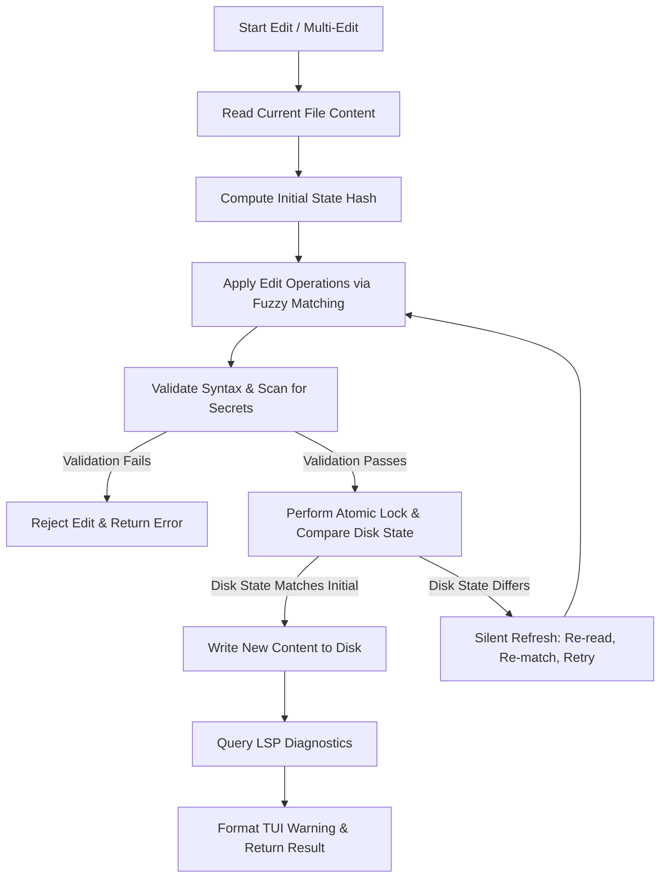

# Edit and Multi-Edit Tools

Phosphor provides two powerful, resilient, and secure tools for modifying files in the workspace: **Edit** (`edit`) and **Multi-Edit** (`multiedit`). These tools go beyond simple text replacement by combining fuzzy matching, concurrent write safety, AST-aware syntax validation, LSP-driven diagnostic feedback, and security guardrails.

---

## 1. Core Architecture

Both tools operate on an **Atomic Read-Modify-Write (RMW)** model to prevent overwriting concurrent external modifications and to guarantee the assistant always operates on the latest file state.



---

## 2. Key Features

### 2.1. Atomic Read-Modify-Write (RMW) with Silent Refresh

To handle cases where a file is modified externally or by another process during an edit cycle, the tools perform the following:
1. **Initial Hash Check:** Stash the initial content string (`initialContent`) of the file when the tool is first called.
2. **Post-Application Check:** Immediately before writing back to disk, the tool re-reads the file from disk.
3. **Silent Refresh:** If the disk content differs from `initialContent`, the tool:
   - Invalidates the fuzzy match cache for the file.
   - Updates `initialContent` to the latest disk content.
   - Re-calculates the target edit locations against the fresh content.
   - Retries the operation (up to 5 attempts) before failing.

### 2.2. Fuzzy Matching & Cache Optimization

When a strict substring match (`strings.Index`) fails, the tool falls back to a **Fuzzy Line Correction** algorithm:
- It searches for the closest line matches using Levenshtein distance calculations.
- **Quote Normalization:** Normalizes single/double/backtick quotes during comparisons to prevent matching failures due to minor style differences.
- **Thread-Safe Cache:** To maintain high performance, fuzzy search results are cached in a thread-safe `map` (using `sync.RWMutex`) keyed by the file path and `oldString`. The cache is automatically invalidated when the file is modified or written to.

### 2.3. Semantic Safety (AST-Aware Syntax Verification)

To prevent the assistant from committing broken code, a pre-write syntax validation step is executed:
- **Tree-sitter Integration:** Parses the proposed file content into an Abstract Syntax Tree (AST).
- **AST Error Detection:** Traverses the AST looking for:
  - Explicit `ERROR` nodes.
  - Nodes where `IsMissing() == true` (e.g., unmatched parentheses, unclosed braces, or missing semicolons).
- **Graceful Degradation:** This feature is compiled conditionally using Go build tags (`sitter_cgo.go` and `sitter_nocgo.go`). If CGO is disabled or the file language is unsupported, the syntax check is gracefully skipped.

### 2.4. Security Guarding (Secret Detection)

Before writing any content to disk, the tools scan the new content using regular expressions to prevent accidental credential leakage:
- **AWS Keys:** Identifies AWS Access Key IDs and Secret Access Keys.
- **Private Keys:** Detects PEM-encoded private keys (e.g., RSA, EC, SSH).
- **Generic API Keys:** Catches high-entropy API keys and bearer tokens.
If a secret is detected, the edit is immediately rejected with a security warning.

---

## 3. Developer Feedback Loop

### 3.1. LSP Diagnostic-Driven Feedback

The edit tools are tightly integrated with the workspace's Language Server Protocol (LSP) manager:
1. **Before Edit:** Retrieve the list of diagnostics and count the number of error-level diagnostics.
2. **After Edit:** Notify the LSPs of the change, wait for the compilation diagnostics to update, and recount the errors.
3. **Diagnostic Diffing:** Compare the pre- and post-edit diagnostics. Any newly introduced diagnostics are stored in the response metadata (`new_diagnostics`).
4. **Self-Healing Prompt Header:** If the error count increases, a warning header is prepended to the tool output returned to the assistant:
   ```text
   WARNING: ACTION REQUIRED: Your last edit introduced N new error(s). Please prioritize fixing these newly introduced diagnostics.
   ```
   This forces the assistant to immediately focus on fixing its own mistakes before proceeding with other tasks.

### 3.2. TUI Warning Banners

The Terminal User Interface (TUI) parses the `new_diagnostics` metadata field and renders a prominent warning banner directly above the diff view:

```text
 ⚠️  ACTION REQUIRED  This edit introduced 1 new diagnostic error(s):
  • main.go:12:3: undefined: foo
```

This ensures that human operators are immediately aware of any compilation or syntax issues introduced by the assistant.

---

## 4. Configuration and Parameters

### `edit` Parameters
| Parameter | Type | Description |
| :--- | :--- | :--- |
| `file_path` | `string` | The absolute path to the file to modify. |
| `old_string` | `string` | The exact block of text to replace. |
| `new_string` | `string` | The replacement text. |
| `replace_all` | `boolean` | (Optional) If `true`, replaces all occurrences of `old_string`. |

### `multiedit` Parameters
| Parameter | Type | Description |
| :--- | :--- | :--- |
| `file_path` | `string` | The absolute path to the file to modify. |
| `edits` | `array` | An array of sequential edit operations, each containing `old_string`, `new_string`, and `replace_all`. |
